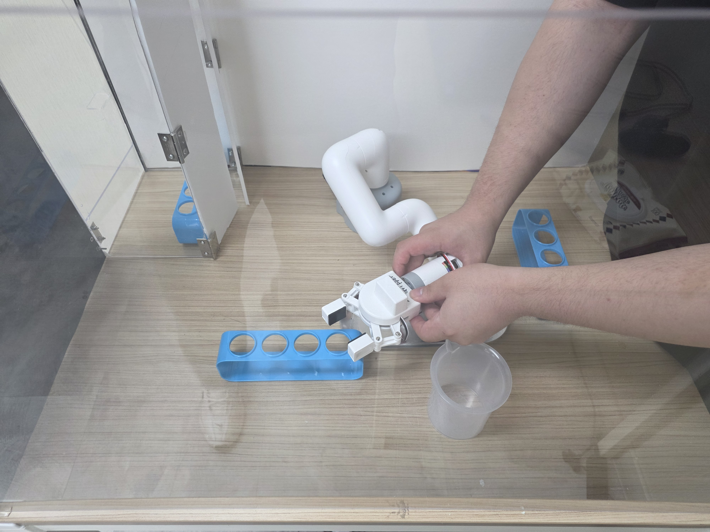
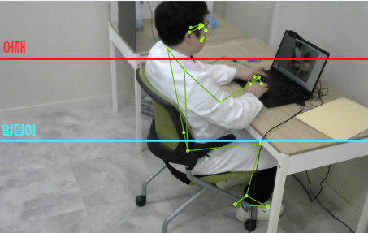
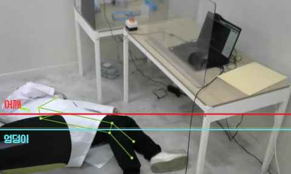
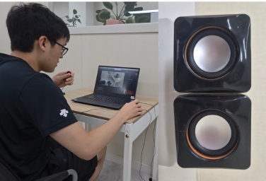
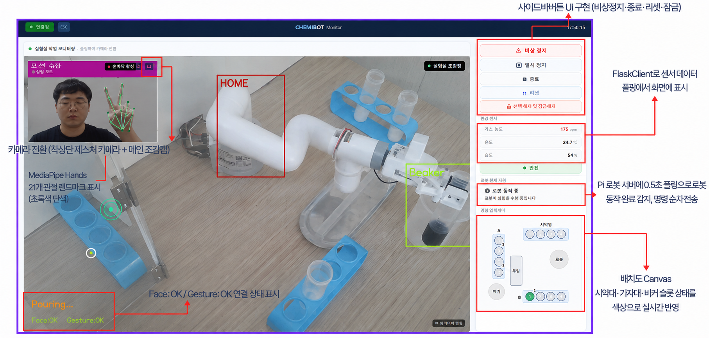
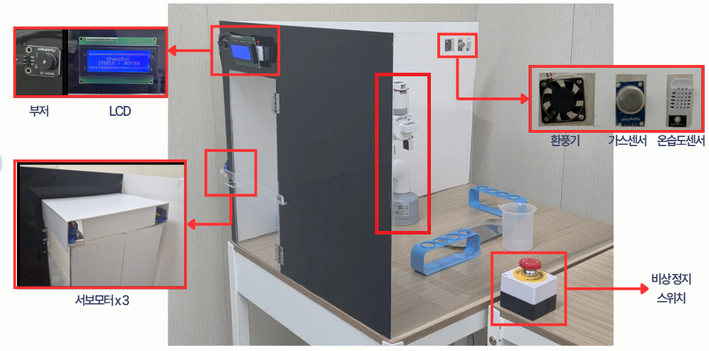
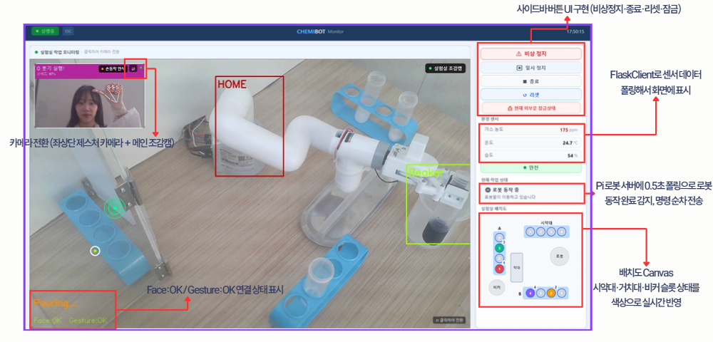

# SterileBot — 팀장 김규태 담당 파트

> **SterileBot**은 무균 실험실 환경에서 6축 협동 로봇팔이 시험관 이송·시약 혼합 등 반복 작업을 자동 수행하고,  
> CCTV·센서가 안전 상황을 실시간으로 감시하는 통합 자동화 시스템입니다.

---

## 담당 역할 요약

| # | 파트 | 핵심 기술 |
|---|------|-----------|
| 1 | 로봇 경로 학습 및 6축 협동 로봇팔 정밀 제어 | 티칭 플레이백, JSON 경로 기록·재생, MyCobot |
| 2 | MediaPipe 기반 쓰러짐 감지 | MediaPipe Pose, TCP/UDP 소켓, 실시간 판별 |
| 3 | 실험실 ↔ 보안실 비상 통신 시스템 | UDP 인터컴, 볼륨 덕킹, sounddevice |
| 4 | 비상 대피 안내 음성 자동 출력 | paplay, 가스·쓰러짐·수동 트리거 통합 |
| 5 | 전체 시스템 통합 및 아키텍처 설계 | 3-노드 네트워크, WPF 통합 제어, PythonProcessManager |

---

## 1. 로봇 경로 학습 및 6축 협동 로봇팔 정밀 제어

> `01_robot_control/`



### 구현 내용

- **티칭 플레이백 방식** : 사람이 직접 로봇팔을 손으로 이끌어 경로를 녹화(티칭)하고, 이를 JSON으로 저장 후 반복 재생(플레이백)
- **슬롯별 경로 분리 저장** : `tube_pickups.json` (집기 4슬롯) / `tube_drops.json` (A1~A4, B1~B4 꽂기) / `pour_trajectory.json` (붓기) / `stir_action.json` (섞기)
- **관절 각도 순차 재생** : 저장된 6축 관절 각도를 `TIME_SCALE` 기반 타이밍으로 재생 → 일관된 반복 동작 보장
- **그리퍼 이벤트 동기화** : 경로 중 특정 타임스탬프에 open/close 이벤트를 삽입해 집기 타이밍 정밀 제어

### 핵심 파일

| 파일 | 역할 |
|------|------|
| `tube_transport.py` | 집기·꽂기·붓기·섞기 전체 경로 재생 엔진 |
| `robot_controller.py` | MyCobot 저수준 제어 래퍼 (각도 전송, 그리퍼) |
| `sterilebot_server.py` | HTTP 서버 — WPF에서 로봇 동작 원격 호출 |
| `Auto_teach_9Poses.py` | 9자세 자동 티칭 시퀀스 (토크 ON/OFF 제어) |

```python
# tube_transport.py 핵심 흐름
load_config()               # 영점 각도 로드
traj = downsample(raw, REPLAY_SAMP)   # 경로 간격 조정
send_safe(traj[0]["angles"], 15)      # 첫 위치 이동
for pt in traj:
    send_safe(pt["angles"])           # 관절 각도 순차 전송
    time.sleep((cur_t - last_t) * TIME_SCALE)
```

---

## 2. MediaPipe 기반 쓰러짐 감지

> `02_fall_detection/`

| 정상 자세 | 쓰러짐 감지 |
|:---------:|:-----------:|
|  |  |

### 구현 내용

- **랜드마크 추출** : MediaPipe Pose로 어깨(11·12)·엉덩이(23·24) 등 9개 관절 좌표를 실시간 추출
- **3중 조건 판별** :
  1. `cond1` — 어깨-엉덩이 Y좌표 차이 < 0.25 (누운 자세 핵심)
  2. `cond2` — 어깨-엉덩이 Y좌표 차이 < 0.22 (엄격 기준)
  3. `cond3` — 어깨 Y좌표 급격히 하강 (쓰러지는 순간 감지)
- **2초 확인 타이머** : 조건 2개 이상 충족 후 2초 지속 시 쓰러짐 확정 → 오탐 방지
- **정규화 좌표** : 0.0~1.0 범위 사용 → 카메라 해상도와 무관하게 동작
- **비상 알림 전송** : 쓰러짐 확정 즉시 통제실 WPF에 TCP(포트 9005) 알림 + UDP 브로드캐스트

```python
# fall_detection.py 판별 로직 핵심
diff_y = abs(shoulder_y - hip_y)
cond1  = diff_y < FALL_DIFF_Y          # 0.25
cond2  = diff_y < FALL_DIFF_Y_STRICT   # 0.22
cond3  = (shoulder_y - prev_shoulder_y) > FALL_DELTA_Y  # 급강하

if sum([cond1, cond2, cond3]) >= 2:
    # 2초 확인 후 send_to_monitoring("EMERGENCY:FALL_DOWN")
```

### 통신 구조

```
실험실 Pi ──[TCP 9005]──▶ 통제실 WPF  (쓰러짐 비상 알림)
실험실 Pi ──[UDP 9998]──▶ 보안실 WPF  (브로드캐스트)
보안실 WPF ─[UDP 9998]──▶ 실험실 Pi   (해제 신호)
보안실 WPF ─[TCP 9999]──▶ 실험실 Pi   (CCTV 영상 스트리밍)
```

---

## 3. 실험실 ↔ 보안실 비상 통신 및 인터컴

> `03_intercom/`



### 구현 내용

- **양방향 UDP 인터컴** : 포트 10000 공용 사용 — 실험실 Pi 마이크 → 보안실, 보안실 → 실험실 스피커 동시 동작
- **볼륨 덕킹(Ducking)** : 인터컴 음성 수신 시 RMS 임계값(5000) 초과 패킷에 대해서만 안내방송 볼륨 50%로 자동 감쇠
- **자동 복구** : 마지막 패킷 수신 후 2초 침묵 시 볼륨 100%로 자동 복원 (watchdog 스레드)
- **잔음 무시** : RMS < 5000 인 노이즈 패킷은 덕킹 트리거에서 제외 → 오작동 방지

```python
# lab_intercom.py 덕킹 핵심
def on_packet_received(data: bytes):
    rms = calc_rms(data)
    if rms < VOICE_THRESHOLD:   # 잔음 무시
        return
    if not _is_ducked:
        call_server("/duck_alarm")   # 안내방송 50% 감쇠
```

---

## 4. 비상 대피 안내 음성 자동 출력

### 구현 내용

- 가스 누출 / 쓰러짐 감지 / 수동 비상정지 — 3가지 트리거 모두 동일한 음성 출력 흐름으로 통합
- 비상 감지 즉시 `paplay`로 실험실 스피커에서 대피 안내방송 자동 재생
- 인터컴 음성이 동시에 들어오면 덕킹으로 인터컴 우선 출력

---

## 5. 전체 시스템 통합 및 아키텍처 설계







### 3-노드 네트워크 구조

```
┌─────────────────┐      TCP 9005      ┌──────────────────┐
│   실험실 Pi      │ ─────────────────▶ │  통제실 WPF PC   │
│ (로봇팔 제어)    │ ◀──────────────── │  (얼굴인증·실험   │
│ (쓰러짐 감지)    │      HTTP API      │   전체 제어)      │
│ (인터컴)         │                    └──────────────────┘
│                 │      UDP 9998            │
│                 │ ◀────────────────────────┤
│                 │ ─────────────────────────▶
└─────────────────┘                    ┌──────────────────┐
        │              TCP 9999        │  보안실 WPF PC   │
        └─────────────────────────────▶│  (CCTV 모니터링  │
                                       │   인터컴 통신)    │
                                       └──────────────────┘
```

### WPF 통합 제어 흐름

```
얼굴 인증 → 실험 시작 → 로봇 원격 제어 → 비상 감지 수신 → 긴급정지 → 실험 종료
```

- **PythonProcessManager** : WPF에서 Python 스크립트(쓰러짐 감지, 인터컴 등)를 자동 실행·종료·좀비 프로세스 정리
- **EmergencyListenerService** : TCP 9005 포트 상시 대기 → 비상 신호 수신 즉시 UI 알림 + 로봇 긴급정지 명령 전송

---

## 기술 스택

| 분야 | 기술 |
|------|------|
| 로봇 제어 | Python, MyCobot SDK, JSON |
| 컴퓨터 비전 | MediaPipe Pose, OpenCV |
| 네트워크 통신 | TCP/UDP 소켓, HTTP 서버 (내장) |
| 오디오 | sounddevice, paplay |
| UI / 통합 | C# WPF (.NET) |
| 하드웨어 | Raspberry Pi, 6축 협동 로봇팔 (MyCobot 280) |

---

## 프로젝트 구조

```
├── 01_robot_control/        # 로봇팔 경로 제어
│   ├── tube_transport.py    # 집기·꽂기·붓기·섞기 재생 엔진
│   ├── robot_controller.py  # MyCobot 제어 래퍼
│   ├── sterilebot_server.py # HTTP API 서버
│   └── Auto_teach_9Poses.py # 자동 티칭 시퀀스
├── 02_fall_detection/       # 쓰러짐 감지
│   └── fall_detection.py    # MediaPipe 기반 실시간 판별
├── 03_intercom/             # 비상 통신
│   └── lab_intercom.py      # UDP 인터컴 + 볼륨 덕킹
└── images/                  # 시연 사진
```
